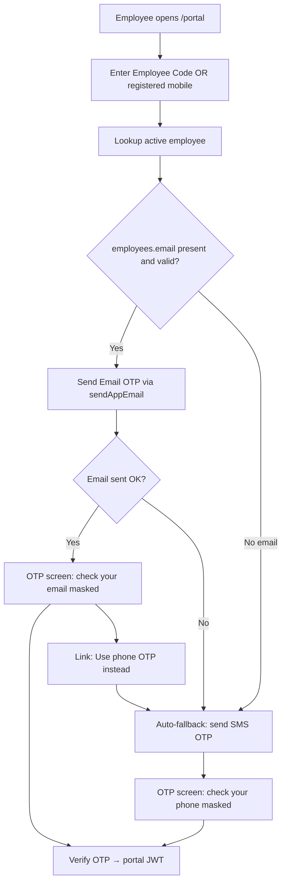

# Employee Portal (ESS) Upgrade Plan

**Status:** In progress (code landed) · **Date:** 16 Jul 2026  
**Live blocker:** `/portal` blank page (SPA rewrite missing on Render)  
**Audience:** Field employees (phone/email OTP) · Allied HCM approvers (Rabia default)

---

## Goals

1. Make `/portal` reliably reachable in production.
2. Prefer **Email OTP**, automatically fall back to **Phone OTP** when email is missing or send fails.
3. Ship **in-portal data-change requests** approved by Allied HCM (default: `rabia.bhutto@asil.com.pk`), with approver list editable in Settings.
4. Let employees **upload a profile photo**.
5. Close security/UX gaps that would otherwise undermine trust (payslip ownership, notifications, leave status).

---

## P0 — Unblock production

### 0.1 SPA rewrite (blank page)

| Item | Detail |
|------|--------|
| Symptom | `hcm.asil.com.pk/portal` (and Render origin) returns **HTTP 200, empty body** |
| Cause | Render Static Site has no rewrite; repo `_redirects` is Netlify-format and ignored |
| Fix | Render → Redirects/Rewrites: `/*` → `/index.html` (Rewrite). Purge Cloudflare cache. Optionally add Blueprint `routes` so it survives redeploys. |
| Verify | `/portal`, `/claims-fill`, `/cmms` all serve `index.html` and mount React |

Until fixed, staff can use admin **Preview Employee Portal** only.

---

## P0 — Auth: Email OTP first, Phone OTP fallback

### Current

- Login asks for **mobile only** → Jazz SMS OTP → portal JWT.
- `portal_otps` stores `phone` only.

### Target login flow



### Rules

1. **Default channel = email** when `employees.email` is non-empty and looks valid.
2. **Auto-reroute to phone OTP** if:
   - no email on record, or
   - email send throws / SMTP fails / bounce path known at send-time, or
   - employee taps “Send code to my phone instead”.
3. Identifier for lookup: keep **phone** (today) and add **employee code (`employees.id`)** so field staff can log in even if they type the wrong phone format. After lookup, OTP goes to email-then-phone — not to a user-typed email (prevents account probing via arbitrary inboxes).
4. Mask destination: `j***@gmail.com` / `03**-***1234`.
5. Same rate limit (5 / 15 min) applies across both channels per employee.
6. Extend `portal_otps`: `channel` (`email`|`sms`), `destination` (email or phone), `employee_id`, keep expiry/used.

### API shape (sketch)

- `POST /api/portal/request-otp` `{ employeeId? , phone? }` → `{ channel, destinationMasked, employeeName, fallbackAvailable }`
- `POST /api/portal/verify-otp` `{ employeeId|phone, otp, channel }` → token
- Internal: try `sendAppEmail`; on failure call existing Jazz SMS path and return `channel: 'sms', fallbackReason`.

### UI

- Login copy: “We’ll email a code if we have your email on file; otherwise we’ll text your registered mobile.”
- Clear banner when falling back: “Couldn’t email you — code sent by SMS.”

---

## P0 — Data change requests (HCM approval)

### Product decision

- Employees request changes **in the portal** (not mailto).
- Changes **do not apply until Allied HCM approves**.
- **Default approver / notify:** `rabia.bhutto@asil.com.pk` (operations_supervisor).
- Approver list is **configurable in System Configs** (Settings).

### Already built

| Layer | Status |
|-------|--------|
| `POST /api/portal/change-request` + whitelist | Done |
| `GET /api/portal/my-requests` | Done |
| Admin queue in Employee Information | Done |
| Approve applies column; reject + SMS | Done |
| Portal UI + submit notification email | **Missing** |

### Config (`system_config`)

Key: `portal_change_request_settings`

```json
{
  "approver_emails": ["rabia.bhutto@asil.com.pk"],
  "notify_on_submit": true,
  "notify_employee_on_decision": true,
  "photo_requires_approval": false
}
```

- Default seed: Rabia’s email.
- System Configs UI: multi-email list (add/remove), save via existing `PUT /api/config/:key`.
- Superadmin (and optionally operations_supervisor) can edit.

### Workflow

1. Employee Profile → “Request a change” → pick field → new value → submit.
2. Backend inserts `Pending` row (existing).
3. **New:** email each `approver_emails` with employee name, field, old→new, deep link to Employee Information → Pending Requests (or HCM home).
4. Approver (Rabia / configured list) Approve or Reject in HCM.
5. Employee sees status in portal history; SMS (and email if present) on decision.

### Approval authorization

- Keep role gate (`superadmin`, `operations`, `payroll_initiator`, and ensure `operations_supervisor` is included — Rabia’s role today).
- **Additionally:** if `approver_emails` is non-empty, only those emails **or** superadmin may approve/reject (settings-driven). Prevents random ops roles applying bank changes without being the designated HCM owner.
- UI: Pending Requests badge / filter “Assigned to me” for configured approvers.

### Whitelist (unchanged unless product expands)

`present_address`, `permanent_address`, `primary_contact`, `emergency_contact`, `email`, `bank_name`, `bank_account`, `account_title`, `nok_*`

**Step-up:** for `bank_account` / `primary_contact` / `email`, require a fresh OTP before submit (channel = same email-first policy).

---

## P0 — Employee profile photo

### Product

- Employee can upload a face photo from Profile.
- Store via existing `uploaded_files` pattern; add `employees.photo_file_id` (or `profile_photo_file_id`).
- Show avatar on portal header + admin Employee Information.

### Rules

| Rule | Recommendation |
|------|----------------|
| Formats | JPEG / PNG / WebP |
| Max size | 2 MB |
| Dimensions | Optional server resize to max 512×512 |
| Approval | **Apply immediately** by default (`photo_requires_approval: false`); email HCM approvers “photo updated”. Toggle in settings if Allied wants approval later. |
| Auth | `POST /api/portal/me/photo` + `GET` (or signed URL) under `requirePortalAuth` only for self |

### UI

- Circular avatar, camera button, crop/preview if lightweight; otherwise simple file picker + preview.
- Replace / remove photo.

---

## P1 — Security & payslips (must follow P0)

1. **Portal-scoped payslip:** `GET /api/portal/payslip/:month/:year` — employeeId from JWT only; PDF or print HTML.
2. **Harden `requireAuth`:** reject `payload.portal === true` on staff routes (or explicit ownership branch). Stops portal JWT reading arbitrary payslips / staff APIs.
3. Extend payslip archive beyond 12 months when data exists.

---

## P1 — Leave polish

1. Server-side block: insufficient balance, overlapping dates.
2. Cancel pending leave from portal.
3. History shows stage: Pending Allied / Pending Client / Approved / Rejected.
4. SMS (and email if present) on decision.
5. Remove Contact HR “Leave Application” mailto so leave has one path.

---

## P1 — Notifications & inbox

1. Portal Home: “Pending requests” card (change requests + leave).
2. On change-request submit: email configured HCM approvers (P0).
3. On decision: SMS + email to employee when email exists.
4. Optional later: unify Portal Claims campaign links into Home “Action required”.

---

## P2 — Later / nice-to-have

- Urdu UI strings for login + leave form.
- PWA / Add to Home Screen for field phones.
- Tax / annual pack downloads.
- Employee-initiated advance request (today advances are read-only).
- Login by CNIC last-4 as tertiary identifier (if data quality allows).
- Audit export of change-request decisions for compliance.

---

## Second-pass recommendations (extra)

These are easy to miss but high leverage for ASIL’s workforce:

1. **Don’t let users type an arbitrary email for OTP** — always resolve employee first, then send to on-file email. Stops enumeration and OTP interception to attacker inboxes.
2. **Email quality gate** — if `employees.email` fails basic validation or bounced recently, treat as “no email” → phone path. Add optional `email_otp_ok` flag later after first successful email login.
3. **Duplicate phone / shared family numbers** — if multiple active employees share a phone, require Employee Code before OTP. Common in field ops.
4. **Photo ≠ bank change** — keep photo fast (immediate) so adoption stays high; keep money/contact fields behind HCM approval.
5. **Approver vacation coverage** — settings list supports **multiple** emails (e.g. Rabia + backup), not a single string.
6. **Deep link after login** — email to Rabia should open Pending Requests with the specific request highlighted (`?cr=id`), not just the module.
7. **Docs debt** — update `SYSTEM_BLUEPRINT` / `AGENTS.md`: OTP + leave exist; this plan supersedes “not built” notes.
8. **Separate naming in UI** — label ESS “Employee Portal” vs “Portal Claims” to avoid staff confusion.
9. **Session hygiene** — 24h JWT OK; add explicit Logout (exists) + “Sign out all devices” later; clear portal token on staff Preview exit if both share browser.
10. **Observability** — log OTP channel chosen (`email`/`sms`/`fallback`) for Jazz cost and SMTP health.

---

## Implementation order

| # | Work | Effort | Owner surface |
|---|------|--------|----------------|
| 1 | Render SPA rewrite + CF purge | 15 min | Ops |
| 2 | Email-first OTP + phone fallback + schema | 1–1.5 d | Backend + EmployeePortal login |
| 3 | Change-request portal UI + history | 0.5–1 d | EmployeePortal Profile |
| 4 | `portal_change_request_settings` + System Configs UI | 0.5 d | SystemConfig + seed Rabia |
| 5 | Email notify approvers on submit; tighten approve ACL | 0.5 d | Backend |
| 6 | Profile photo upload + `photo_file_id` | 0.5–1 d | Portal + Employee Information |
| 7 | Portal payslip route + reject portal JWT on staff APIs | 0.5–1 d | Backend |
| 8 | Leave cancel / stages / decision notify | 1–2 d | phase2 + portal |
| 9 | Docs refresh | 1 h | Docs |

---

## Out of scope (this plan)

- Replacing Portal Claims magic-link campaigns.
- Full mobile native apps.
- Manager self-service leave calendar for client focals (email link stays).

---

## Acceptance criteria

- [ ] `https://hcm.asil.com.pk/portal` shows Email/Phone OTP login (not blank).
- [ ] Employee with email receives email OTP; without email (or on SMTP failure) receives SMS automatically.
- [ ] Employee can submit a field change; Rabia (default) gets email; change applies only after Approve in HCM.
- [ ] Approver emails editable in System Configs and take effect on next submit.
- [ ] Employee can upload/replace profile photo; visible in portal + admin.
- [ ] Payslip view only for own employeeId; portal JWT cannot fetch another employee’s payslip.
