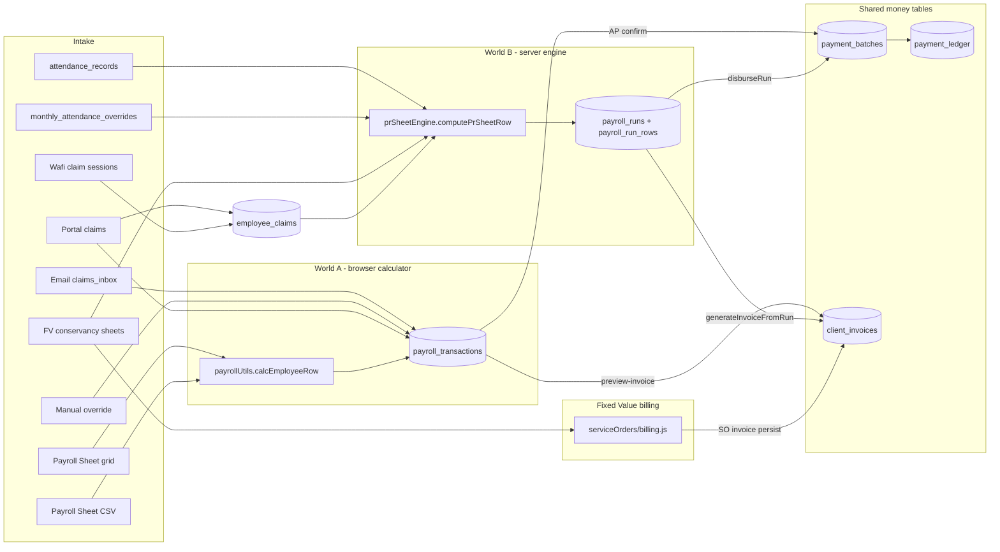
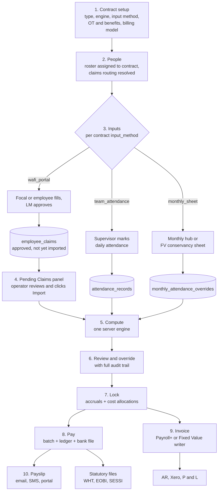

# ASIL HCM — Track B: HRMS Unification Plan

**Status:** Draft for owner review — planning only, no application code changed
**Author:** Track B full plan review (senior HRMS/payroll systems architect pass)
**Date:** 2026-08-10
**Repo state at review:** branch `fix/july-wafi-payroll-tax`, tip `fc0118f`
**Supersedes / absorbs:** `.agents/REMEDIATION_PLAN.md` phases 5–9, `docs/AUTONOMOUS_EXECUTION_PLAN.md` weeks 1–4
**Does not touch:** Track A (July/August operational firefighting on Wafi and FV) — see §10.3

> **Document note.** The owner brief referenced `.cursor/plans/payroll_single_journey_ede00334.plan.md`. That file does not exist in this workspace (the only file in `.cursor/plans/` is `employee_portal_ess_upgrade.plan.md`). Everything below is derived from the code as it stands, plus `OWNER_BOARD.md`, `ARCHITECTURE.md`, `.agents/REMEDIATION_PLAN.md`, `docs/OWNER_VISION_AUDIT.md`, and the `audit/` evidence files. If that plan exists elsewhere, reconcile before B1 starts.

---

## 1. Executive summary

ASIL HCM is not one system. It is roughly nine ways to get data in, three ways to calculate money, two places to store the answer, and two ways to bill it — stitched together by people who remember which screen to open. That is the real reason payroll feels unreliable, and it is why the same employee can be right on one screen and wrong on another in the same month.

Concretely, today: nine distinct intake paths feed pay (Payroll Sheet grid, Payroll Sheet CSV import, daily attendance ledger, monthly attendance hub, Fixed Value conservancy sheets, Wafi Gmail claim sessions, employee portal claims, email claims inbox, and manual claim overrides). Two of them write only to the old world, two write to both worlds at once, and four write only to the new world. Two calculators exist — a browser calculator in `frontend/src/payrollUtils.js` and a server engine in `backend/src/payroll/prSheetEngine.js` — and they disagree on at least ten specific formulas, including SESSI, provident fund, gratuity, medical, overhead and the proration basis itself. Two invoice writers exist. Nothing enforces which one a contract should use.

Track B fixes this by declaring the contract to be the configuration object for everything downstream. A contract will state its type (Payroll+ versus Fixed Value/Conservancy), who supplies hours and how, whether overtime and each benefit apply, which billing model it uses, and — critically — which engine computes it. Every module then reads that single declaration instead of inferring behaviour from employee ID prefixes, client name substrings, and hardcoded contract IDs, which is how it works today.

The sequencing is deliberately conservative because two things are already working and must not break: PSO Fixed Value (185 headcount on `CTR-PSO-NORTH-ZONE`, verified July run) runs entirely on the new engine and is the only proof that the new engine can carry a real contract; and the Wafi claims portal chain (focal fills, line manager approves, email magic links, submit-by-17th / approve-by-22nd calendar) is nearly finished. Both become frozen regression anchors from day one of B1, before any refactor is allowed to start.

The work is nine phases (B1–B9), each with an explicit exit gate and a "prove the anchors still pass" requirement. Phases B1 and B2 change no arithmetic at all — they build the safety net and the contract rulebook. B3 is the single riskiest phase: collapsing two calculators into one. B4 through B6 unify claims, inputs and tax. B7 through B9 unify pay, invoicing, and finally retire the old calculator and chain the month-close together. All of it happens on `staging`, contract type by contract type, and production cutover happens per contract with an explicit owner sign-off each time.

The single most important behavioural change for the owner's daily experience is in B4: claims stop silently overwriting payroll. Instead a **Pending Claims panel** appears on the Payroll Sheet showing what arrived, from whom, approved by whom, and what it would do to pay — and an operator clicks **Import**. Nothing lands in payroll without a human decision, and every import is reversible and attributed.

---

## 2. Current state map

### 2.1 Intake paths — where pay data enters

| # | Path | Entry point | Lands in | Feeds |
|---|---|---|---|---|
| I1 | Payroll Sheet grid (manual cell edits) | `PayrollSheet.jsx` → `api.savePayroll` | `payroll_transactions` (`server.js:3441`) | World A only |
| I2 | Payroll Sheet CSV import | `ImportModal` in `PayrollSheet.jsx:110` (key = `ASIL Employee Code`) | browser state → `payroll_transactions` | World A only |
| I3 | Daily attendance ledger | `POST /api/attendance/mark` (`server.js:6267`), `/api/attendance/parse-csv`, `/manual-bulk` | `attendance_records` | World B only |
| I4 | Monthly Attendance Hub | `/api/attendance/monthly-hub/import` and `/override` (`attendance/routes.js`) | `monthly_attendance_overrides` | World B only |
| I5 | Fixed Value conservancy sheets (Excel or Google Drive) | `serviceOrders/attendanceIngest.js`, `driveAttendance.js` | `monthly_attendance_overrides` (`source='fv_conservancy_attendance'`) + `so_deductions` | World B only |
| I6 | Wafi Gmail claim sessions | `/api/wafi-claims/sessions/:id/stage-payroll` (`server.js:7291`), `/verify` (`8047`) | `employee_claims` (`focal_approved`) | World B only |
| I7 | Employee portal claims | `claims/portalService.js` approval flow | **both** `employee_claims` (line 1396) **and** `payroll_transactions` (line 1450) | Both worlds |
| I8 | Email claims inbox | `POST /api/claims/:id/push-to-payroll` (`server.js:6674`) | `payroll_transactions` (line 6699) | World A only |
| I9 | Manual claims override | `applyManualOverride` (`portalService.js:1561`) | `claim_manual_overrides` + `payroll_transactions` (line 1625) | World A only |

### 2.2 Compute and storage

### 2.3 Where the two calculators disagree

Both compute a monthly row and both feed the same downstream money tables, but the arithmetic differs. This table is the concrete answer to "why do the numbers not match?" — every row is a live divergence in code today.

| Item | World A — `frontend/src/payrollUtils.js` | World B — `backend/src/payroll/prSheetEngine.js` |
|---|---|---|
| Proration basis | one formula only: `salary × paid_days / working_days` (line 99, comment explicitly says "No Mode A / Mode B") | dual: Model A `salary × (calendarDays − absentDays) / calendarDays` when present/absent supplied; otherwise `salary × paid/working` (lines 216–238) |
| OT rate | `gross / (26 × 8)`, hardcoded (line 106) | `salary / (ot_divisor_days × ot_divisor_hours)`, policy-driven, defaults 26 × 8 (`computeOtRates`) |
| OT tiers | 2× and 3× only | 1×, 2×, 3× |
| SESSI | `grossForTPC > 40000 ? 0 : min(2400, 6% × grossForTPC)` — gross-based, variable (line 221) | `salary < 45000 ? 2400 : 0` — contractual-salary-based, flat (line 265) |
| Provident fund | EE `gross/24` when `pf_enrolled`; **employer match included in payroll cost** (lines 190, 225) | only an explicit `pfDeduction` input override; **no employer PF in payroll cost** |
| Gratuity | only when `eosb_type === 'Gratuity'` (line 200) | always accrued: `salary / gratuity_accrual_months`, default 12 (line 287) |
| Medical | `totalMedical` **included** in total payroll cost (line 225) | `medicalCoverage` computed and returned but **not added** to `totalPayrollCost` (line 294) |
| Overhead per head | `cfg.overhead_per_employee` included in cost (line 225) | no equivalent |
| Other deductions | **subtracted** from total payroll cost (line 225) | not subtracted from cost |
| Education cess | flat `cfg.edu_cess` amount | `policy.edu_cess_enabled ? 8.33% × grossForTPC : 0` |
| Service charge | `cfg.service_charges_pct` as a **percent** (0–100) | `policy.service_charge_pct` as a **fraction** (default 0.18) |
| Sales tax | province resolved from `emp.province || emp.location` in the browser | `input.salesTaxRate` from `policy.sales_tax_rate`, else 0.18 default |
| Income tax | duplicated FBR slab table in the browser (`calcWHT`, line 31) | `taxEngine.calculateMonthlyIncomeTax` — the single legal source |

Two of these deserve owner attention before B3 rather than after: the **medical exclusion from World B payroll cost**, and the **SESSI threshold difference** (40,000 gross versus 45,000 contractual salary). Both change what is billed to the client, not just what is paid to the employee. They are listed as verification items in B1, not asserted as bugs — Fixed Value parity was validated with the current behaviour, so one of the two definitions is already accepted somewhere.

### 2.4 UI screens and their disconnects

| Screen | File | Reads / writes | Disconnect |
|---|---|---|---|
| Payroll Sheet | `PayrollSheet.jsx` (1,604 lines) | `payroll_transactions` | Only screen with bank-file split, WHT/EOBI/SESSI statutory exports and Xero CSV; those live in `payrollUtils.js` and do not exist server-side |
| Payroll Run | `features/payroll/PayrollRun.jsx` (528 lines) | `payroll_runs` / `payroll_run_rows` | Compute → lock → invoice → disburse works, but no statutory exports, no bank file, no claims visibility |
| Fixed Value / PSO | `features/fixedValue/FixedValueContracts.jsx` + wizard | `service_orders`, `so_deductions`, `client_invoices` | Only place a contract's commercial configuration can be edited in a structured way — and only for Fixed Value |
| Contract Policies | `features/contracts/ContractOps.jsx` | `contract_policies` | Exposes a subset of policy fields; no engine flag, no benefit toggles, no input-method declaration |
| Attendance | `AttendanceManagement.jsx`, `features/attendance/AttendanceIntake.jsx` | `attendance_records`, `monthly_attendance_overrides` | Invisible to Payroll Sheet entirely |
| Wafi Claims | `WafiClaimsDashboard.jsx` (1,647 lines) | `wafi_claims_*` → `employee_claims` | Correct target, but only Payroll Run consumes it |
| Portal Claims | `features/claims/PortalClaimsHub.jsx` | `portal_claim_*` → both worlds | Auto-injects into `payroll_transactions` with no operator review |
| Claims Queue / Email Claims | `features/claims/ClaimsQueue.jsx`, `EmailClaimsListener.jsx` | `claims_inbox` → `payroll_transactions` | Orphan: never reaches the new engine |
| Accounts Payable | `AccountsPayable.jsx` | `payment_batches`, `payment_ledger` | Fed by two producers with different guards |

### 2.5 The five structural disconnects, named

1. **No engine authority.** Nothing in the database says which calculator owns a contract. `contract_policies.payroll_engine` was designed in `.agents/sessions/S6B_engine_flag.md` but never built. Both systems can compute the same month for the same people.
2. **Claims arrive through four doors into two stores.** Wafi sessions and portal claims reach `employee_claims`; the email inbox and manual overrides reach only `payroll_transactions`; portal claims reach both, doubling the risk of double-counting (the code itself warns about this at `portalService.js:1613`).
3. **Attendance is invisible to the screen that pays people.** `attendance_records` and `monthly_attendance_overrides` drive World B; the Payroll Sheet reads neither.
4. **Contract behaviour is inferred, not declared.** `isWafiBpoEmployee` matches on an employee-ID regex and a client-name substring (`payrollUtils.js:25`); July-2026 Wafi tax behaviour is gated on `month === 7 && year === 2026` in both the engine and the browser; PSO behaviour keys off hardcoded contract IDs in `sitesMeta.js`. Every one of these is a rule that belongs in configuration.
5. **Two invoice writers, one guard.** `generateInvoiceFromRun` throws `409 USE_SO_INVOICE` for Fixed Value contracts — good — but nothing symmetrically prevents a Payroll+ contract being invoiced through the service-order path, and the legacy `/api/payroll/:year/:month/preview-invoice` path still exists.

---

## 3. Target state — the single journey

One path, one calculator, one claims store, one payment path, one invoice writer per contract type, with the contract as the configuration object that steers all of it.

Non-negotiables of the target state:

- **Exactly one calculator.** `prSheetEngine.js` on the server. `payrollUtils.js` arithmetic is deleted in B9; its exports (bank file split, statutory files, Xero CSV) are ported to the server in B7 first.
- **Claims never auto-post.** Approved claims sit in `employee_claims` in an importable state until an operator imports them. Import is a recorded, reversible event.
- **The Payroll Sheet survives as a screen, not as a calculator.** For contracts on the runs engine it becomes a read/edit view over `payroll_run_rows` — same familiar grid, same exports, different source of truth.
- **Nothing is inferred from an ID or a client name.** Every behavioural branch is a contract configuration field.

---

## 4. Module integration matrix

Rows are producers, columns are consumers. **Target** state; `✗ kill` marks a flow eliminated during Track B.

| Producer → Consumer | Contract config | Roster | Claims store | Attendance | Payroll engine | AP / bank | Invoicing | Portal | P&L / Xero |
|---|---|---|---|---|---|---|---|---|---|
| **Contract setup** (`contract_policies`, `contracts.meta`) | — | assigns policy | routing + calendar | declares input method | engine flag, OT, benefits, proration | — | billing model | claim eligibility | cost centre |
| **Roster / employees** | — | — | resolves focal/LM | eligible population | headcount for run | bank details | — | portal identity | — |
| **Claims** (`employee_claims`) | reads calendar | reads routing | — | — | consumed **only via Import** | — | reimbursables | shows own claims | — |
| **Attendance** (`attendance_records`, `monthly_attendance_overrides`) | reads input method | — | — | — | paid days, OT hours, absences | — | FV absence deduction | — | — |
| **Payroll engine** (`payroll_run_rows`) | reads all policy | — | marks `in_payroll_run` | — | — | `disburseRun` only | run → invoice (Payroll+) | payslip source | `cost_allocations` |
| **AP / bank** (`payment_batches`, `payment_ledger`) | — | — | — | — | sets run `paid` | — | — | payment status | Xero AP |
| **Invoicing** (`client_invoices`) | reads billing model | — | — | — | — | — | — | — | AR + Xero |
| **Leave desk** (`employee_leaves`, `contract_leave_policies`) | per-contract entitlement | balances | — | leave days = paid | leave deduction input | — | — | leave requests | — |
| **Portal** | — | contact updates | claim submissions | — | payslip read | — | — | — | — |

Orphan flows eliminated:

- ✗ `POST /api/claims/:id/push-to-payroll` writing `payroll_transactions` (`server.js:6699`) → redirected into `employee_claims` in B4.
- ✗ Portal claims dual-write to `payroll_transactions` (`portalService.js:1450`) → single-write in B4.
- ✗ Manual override direct write to `payroll_transactions` (`portalService.js:1625`) → becomes an attributed `employee_claims` row of kind `manual` in B4.
- ✗ Payroll Sheet CSV import creating pay inputs that no attendance table ever saw → becomes a monthly-hub import in B5.
- ✗ Duplicate FBR slab table in the browser (`payrollUtils.js:31`) → deleted in B9.
- ✗ `GET /api/payroll/:year/:month/preview-invoice` legacy invoice preview → superseded in B8.

---

## 5. Phased roadmap

Every phase has a **gate**, and every gate includes "the PSO and Wafi anchors from B1 still pass byte-identical". No phase begins before the previous gate is signed.

### Guardrails that apply to every phase

**PSO / Fixed Value guardrail.** `CTR-PSO-NORTH-ZONE` (185 headcount, July run #117, net 8,090,438) and `CTR-PSO-CORO-MA` must produce identical payroll and invoice numbers after every phase. Specifically: Model A conservancy wages `salary × (30 − sheet_absent) / 30`; explicit sheet `days_absent` (never `WD − present`); absence deduction `(lineRate / roleCount) / 30 × absentDays`; the `409 USE_SO_INVOICE` guard; and the stamped-invoice anchors Tarujabba `2,156,300 / 323,445 / 2,479,745` and CORO SS94 `4,136,919.94 / 661,907.19 / 4,798,827.13`.

**Wafi guardrail.** `CTR-1773046722553` (BPO), `CTR-1773048704450` and `CTR-1773048523696` (FM). The focal/LM routing columns (`claim_authority`, `line_manager_email`), the magic-link actions (`/api/wafi-claims/focal-action`, `lm-action`), the `approval_state ∈ {ready_for_hcm, legacy_bypass}` gate on verify/stage, the submit-17th / approve-22nd calendar in `contract_claim_policies`, and portal SAMPLE mode must all keep working unchanged. Wafi work in Track A continues in parallel; Track B rebases onto it, never the reverse.

---

### B1 — Anchors and safety net (no behaviour change)

**Goal:** make regression impossible to miss before anything is refactored.

1. Re-baseline the golden files. `audit/july_inputs/july_verify.csv` scoped to the **221 Wafi BPO rows** becomes `audit/golden/july2026_bpo_221.csv`. Re-run it against current `main` — the last measured state (`audit/JULY_GAP_REPORT_FINAL.md`, 2026-08-03) predates the bonus and WHT fixes in `7ae7439` and `fc0118f`, so the numbers in that report are stale and must be regenerated before they are used as a target.
2. Capture PSO run anchors: full `payroll_run_rows` snapshot for `CTR-PSO-NORTH-ZONE` and `CTR-PSO-CORO-MA` for the last computed period → `audit/golden/pso_run_anchor.json`.
3. Capture FV invoice anchors (Tarujabba, CORO SS94) → `audit/golden/fv_invoice_anchors.json`.
4. New test suite `backend/tests/trackB.anchors.test.js` — pure-function replay of the golden rows through `computePrSheetRow`, failing on any drift.
5. New integration suite `backend/tests-int/trackB.guardrails.test.js` — Wafi approval chain end-to-end, FV compute → SO invoice, engine invoice 409.
6. Write down the two open arithmetic questions (medical in payroll cost; SESSI 40k gross vs 45k salary) as `audit/golden/OPEN_ARITHMETIC.md` with evidence for each side. **Owner decides in B2, not the agent.**
7. Refresh `staging` from a production snapshot (`scripts/backup_prod.ps1` → Neon `staging` branch).

**Gate G1:** anchor suites green on `staging`; `npm test` and `npm run test:int` green; `audit/golden/` committed; staging `/health` 200 with the refreshed database.

---

### B2 — Contract configuration spine (no arithmetic change)

**Goal:** the contract declares what it is; nothing yet acts differently.

1. Migration adding the configuration fields in §7 to `contract_policies` and `contracts.meta`, all with defaults that reproduce today's behaviour exactly.
2. Backfill every active contract from observed behaviour, marking each field `VERIFIED` or `ASSUMED` — this is `.agents/sessions/S5B3_contract_policy_overhaul.md` step 1, unchanged and still correct.
3. **Owner sign-off pass** on the completed truth table, including the two open arithmetic questions from B1. This is the single largest owner time commitment in Track B and it cannot be delegated.
4. Build the **Contract Rulebook** screen: one page per contract showing type, engine, input method, OT and benefit toggles, proration basis, statutory rules, billing model, claims calendar and leave policy — all with inline help stating what each field does to pay. Role-gated to superadmin and finance_manager, every change writes `logAudit`.
5. Add `POLICY_MISSING` (409) to `POST /api/payroll-runs/compute` when a contract has no policy row — today it silently computes with defaults.

**Gate G2:** truth table signed with zero `ASSUMED` cells; Rulebook edit round-trips and appears in `audit_log`; recompute of every anchor still byte-identical; `POLICY_MISSING` covered by an integration test.

---

### B3 — One calculator (highest risk phase)

**Goal:** `prSheetEngine.js` becomes the only place money is calculated.

1. Implement `contract_policies.payroll_engine` (`legacy` | `runs`) enforcement, per `S6B`: `POST /api/payroll/:year/:month` rejects employees of `runs` contracts with `409 CONTRACT_ON_RUNS_ENGINE`; `PayrollSheet.jsx` renders those rows read-only with a banner. Default stays `legacy` everywhere.
2. Port each World A divergence from §2.3 into the engine as an **explicit policy-driven option**, not as a global change: `employer_pf_in_cost`, `medical_in_cost`, `sessi_basis` (`gross_40k` | `salary_45k`), `overhead_per_head`, `gratuity_condition` (`always` | `eosb_type_only`), `other_deduction_reduces_cost`, `edu_cess_mode`. Every existing contract is seeded with the option value that reproduces its current output, so PSO does not move by one rupee.
3. Rewrite the Payroll Sheet as a view over `payroll_run_rows` for `runs` contracts, preserving the grid, the breakdown panel and every export.
4. Delete the July-2026 hardcodes (`isWafiBpoJulyContext`, `month === 7 && year === 2026`, `window.__payrollMonth`) in favour of a dated `contract_tax_rules` row.

**Gate G3:** all anchors byte-identical; Wafi BPO 221 golden file matches within ±1 PKR per employee; one non-pilot contract computed in both engines on staging with a zero-variance report; `npm test` and `npm run test:int` green.

---

### B4 — One claims spine and the Pending Claims panel

**Goal:** every claim lands in one store, and no claim reaches pay without an operator clicking Import.

1. `employee_claims` becomes the sole claims store. `claims_inbox` push-to-payroll, portal dual-write, and manual override all redirect there with `source_kind` provenance (`email`, `portal`, `wafi`, `manual`) reusing the existing `source_kind` / `source_session_id` / `source_ref` columns and their partial unique index.
2. New import state machine on the claim: `received → approved → importable → imported → in_payroll_run`, with `imported_by`, `imported_at`, and a reversible un-import while the run is unlocked.
3. **Pending Claims panel** on the Payroll Sheet and Payroll Run: grouped by employee, showing claim type, hours or amount, who filled it, who approved it, source, and the delta it would apply — with per-row and bulk **Import**, plus **Reject with reason**. Nothing auto-applies.
4. Duplicate detection across sources before import (the warning at `portalService.js:1613` becomes a hard pre-import check).
5. Claims calendar enforcement from `contract_claim_policies`: submit-by and approve-by days, `following_month` versus `same_month` settlement.

**Gate G4:** an OT claim submitted through each of the four doors appears exactly once in the panel, imports once, and is reversible; Wafi focal → LM → import walkthrough recorded on staging; no code path writes `payroll_transactions` from a claims source.

---

### B5 — One input spine

**Goal:** the contract's declared input method decides which intake is authoritative, and conflicts surface instead of silently overwriting.

1. Precedence engine driven by `input_method`: `wafi_portal`, `team_attendance`, `monthly_sheet`, `fv_conservancy`. For each contract exactly one intake is authoritative for paid days and OT; others become advisory and are shown as variance warnings.
2. Payroll Sheet CSV import is rewritten to post into `monthly_attendance_overrides` via the monthly-hub route rather than creating pay rows directly.
3. Conflict panel: when two sources disagree on paid days or OT hours for the same employee-month, the run refuses to lock until an operator resolves it.
4. Monthly attendance report becomes a first-class close artefact rather than an export.

**Gate G5:** every active contract has exactly one authoritative input; a deliberate conflict blocks lock on staging; FV conservancy path unchanged.

---

### B6 — Tax and statutory alignment

**Goal:** implement the owner's locked tax decision properly instead of month-specific patches.

1. Monthly WHT is computed on **gross salary only**. Bonus lump sums, overtime payouts, arrears, OPD and reimbursements are excluded from the monthly annualisation base and recorded in a new `tax_deferred_components` ledger.
2. FY-end true-up: a June (or separation-triggered) reconciliation run that annualises the deferred components and settles the difference on one payslip line.
3. Separation flow: final settlement pulls the deferred ledger, gratuity, PF and leave encashment into one statement.
4. `taxEngine.js` becomes the sole slab authority; slab tables get effective-dated versioning so a future Finance Act does not destroy history (closing known gap #10).

**Gate G6:** worked example signed by the owner for one high-bonus and one OT-heavy employee across a full financial year; anchors unaffected for periods before the switch date.

---

### B7 — One pay path, one payslip

**Goal:** everything the Payroll Sheet can produce today, the server produces from run rows.

1. Port to the server: HBL / other-bank split (`buildBankFileSplit`), WHT filing file, EOBI file, SESSI file, full payroll CSV, Xero sales-invoice CSV — currently browser-only in `payrollUtils.js:246–557`.
2. `disburseRun` becomes the only producer of payroll `payment_batches`; the World A AP confirm path is disabled per contract as each contract flips engine.
3. Payslip: one template, branded, with logo; served identically to email, SMS link and portal. The portal World B bridge (`src/modules/portal/payslipBridge.js`) is already built and wired at `server.js:2378` and `2874` — this phase makes it the only source.
4. Payslip delivery becomes a run action with a delivery log (sent, skipped, bounced) rather than a fire-and-forget loop.

**Gate G7:** a staging run produces a bank file byte-comparable to the Payroll Sheet output for the same inputs; statutory files validated against a filed month; payslip visible in portal for a run-paid employee.

---

### B8 — One invoice writer per contract type

**Goal:** billing model, not screen choice, decides how a contract is invoiced.

1. Symmetric guard: Payroll+ contracts rejected by the service-order invoice path, mirroring the existing `USE_SO_INVOICE` guard.
2. Retire `GET /api/payroll/:year/:month/preview-invoice`.
3. One invoice numbering authority; one credit-terms source (`contract_policies.credit_days`); one tax treatment implementation shared between the two writers (income WHT and ST withholding shown in the receivable section only, never reducing the stamped grand total — the rule already documented in `ARCHITECTURE.md`).
4. AR, P&L allocation and Xero push read from the unified invoice regardless of writer.

**Gate G8:** FV invoice anchors unchanged; a Payroll+ run invoice reconciles to the sum of its run rows; Xero CSV matches the legacy format for a control month.

---

### B9 — Retirement and orchestration

**Goal:** delete the second brain and chain the month together.

1. `POST /api/payroll/:year/:month` returns `410 Gone` once every contract is on `runs`. `payroll_transactions` is retained forever as history — never dropped.
2. Delete `calcEmployeeRow`, `calcWHT`, `calcEOBI_fn`, `calcPF_fn` and the duplicate slab table from `payrollUtils.js`.
3. Month-close orchestration: a per-contract close checklist that chains inputs closed → claims imported → compute → review → lock → invoice → disburse → payslips, with each step gated and an owner-visible status board.
4. Backlog absorbed from `S9`: paid background worker (`JOBS_RUNNER=worker`), `server.js` decomposition, imprest workflow, medical tiers.

**Gate G9:** zero writes to `payroll_transactions` for 60 consecutive days; all contracts on `runs`; the close checklist drives a full month end-to-end.

### Mapping to existing session files

| Track B phase | Absorbs |
|---|---|
| B1 | `S5B` re-baseline, `S5B1` |
| B2 | `S5B3`, part of `S6A` |
| B3 | `S6B`, `S5B2`, `S7` template |
| B4 | `S8A`, `S8B` |
| B5 | new (no existing session covers input precedence) |
| B6 | new |
| B7 | `S5C` generalised, `S6A` remainder |
| B8 | new |
| B9 | `S7R`, `S9` |

---

## 6. Data model changes

All DDL via `backend/migrations/` (node-pg-migrate), idempotent, reviewed before applying. No `CREATE TABLE` in `server.js` — that block stays frozen. After each migration reaches production, regenerate `database/schema.sql` via `scripts/regen_schema.ps1`. Never touch `audit/groundtruth/schema_prod.sql`.

| Phase | Migration | Change | Default / safety |
|---|---|---|---|
| B2 | `contract_config_spine` | `contract_policies`: `contract_type`, `payroll_engine`, `input_method`, `ot_applicable`, `benefits_profile jsonb`, `proration_basis`, `sessi_basis`, `medical_in_cost`, `employer_pf_in_cost`, `overhead_per_head`, `gratuity_condition`, `other_deduction_reduces_cost`, `edu_cess_mode` | every default reproduces current behaviour; `payroll_engine` defaults `legacy` |
| B2 | `contract_config_audit` | `contract_policy_changes` — who changed which field, old and new value, effective date | append-only |
| B3 | `contract_tax_rules` | effective-dated per-contract tax behaviour, replacing the July-2026 hardcodes | seeded to reproduce July 2026 exactly |
| B4 | `claims_import_state` | `employee_claims`: `import_state`, `imported_by`, `imported_at`, `import_batch_id`, `rejected_reason` | existing rows backfilled to match current status |
| B4 | `claim_import_batches` | one row per operator Import action, reversible | — |
| B5 | `attendance_source_precedence` | `monthly_attendance_overrides.source_priority`; `attendance_conflicts` table | advisory only until B5 gate |
| B6 | `tax_deferred_components` | per employee, per FY: bonus, OT, arrears deferred from monthly WHT | — |
| B6 | `tax_slab_versions` | effective-dated FBR slabs | seeded with FY 2025-26 slabs currently in `taxEngine.js` |
| B7 | `payroll_output_artifacts` | generated bank files, statutory files, Xero CSVs with checksum and generator identity | — |
| B7 | `payslip_delivery_log` | per employee per run: channel, status, timestamp, failure reason | — |
| B8 | `invoice_source_guard` | `client_invoices.source_kind` (`payroll_run` \| `service_order` \| `manual` \| `bill`) + check constraint | backfilled from `notes` where derivable |

Explicitly **not** changing: `payroll_transactions` (frozen as history), `payment_batches` / `payment_ledger` column shapes (World A and World B both write them and the formats must stay identical), `wafi_claims_*` provenance tables.

---

## 7. Contract configuration schema

The contract is the configuration object. Everything below lives on `contract_policies` (effective-dated) except where noted, and is edited on one Rulebook screen.

### 7.1 Identity and type

| Field | Values | Default | Drives |
|---|---|---|---|
| `contract_type` | `payroll_plus` \| `fixed_value` \| `conservancy` | derived from `billing_model` at backfill | which journey, which invoice writer, which UI |
| `payroll_engine` | `legacy` \| `runs` | `legacy` | which calculator may compute; blocks the other |
| `billing_model` | `headcount_rate` \| `cost_plus` \| `service_order_deduction` \| `fixed_value` | existing value | invoice writer, `USE_SO_INVOICE` guard |
| `service_type` (on `contracts`) | free text; `Fixed Value / Conservancy` is load-bearing | existing | FV detection today — becomes advisory once `contract_type` exists |

### 7.2 Who supplies hours, and how

| Field | Values | Default | Drives |
|---|---|---|---|
| `input_method` | `wafi_portal` \| `team_attendance` \| `monthly_sheet` \| `fv_conservancy` | inferred at backfill | which intake is authoritative; conflict detection |
| `attendance_input_mode` | `full_ledger` \| `absent_only` | `full_ledger` | `derivePaidDays` |
| `proration_basis` | `calendar_30` \| `calendar_actual` \| `working_days` | matches current per-contract behaviour | Model A vs working-day proration |
| `use_calendar_working_days` | boolean | `true` | working-days computation |
| `working_days_override` | integer | null | sheet override |
| `standard_month_days` | integer | 30 | fallback basis |

### 7.3 Overtime and benefits

| Field | Values | Default | Drives |
|---|---|---|---|
| `ot_allowed` | boolean | `true` | `OT_NOT_ALLOWED` warning, zeroing |
| `ot_applicable_tiers` | subset of `1x`, `2x`, `3x` | `2x,3x` | which claim tiers may be filled and paid |
| `ot_divisor_days` × `ot_divisor_hours` | integers | 26 × 8 | OT hourly rate; **PSO uses 30 × 8 @ 1× — verify at backfill** |
| `ot_monthly_cap_hours` | numeric | null | `OT_CAPPED` |
| `ot_client_managed` | boolean | false | whether OT is billed or absorbed |
| `benefits_profile` | jsonb: `{ eobi, sessi, pf, gratuity, medical, life_insurance, bonus, edu_cess }` each with applicability and basis | current behaviour | employer cost build-up |
| `sessi_basis` | `gross_40k` \| `salary_45k` \| `none` | per §2.3 decision | SESSI amount |
| `medical_in_cost` / `employer_pf_in_cost` / `other_deduction_reduces_cost` | boolean | per §2.3 decision | total payroll cost, therefore invoice |
| `gratuity_condition` | `always` \| `eosb_type_only` | per contract | gratuity accrual |
| `bonus_accrual_months`, `bonus_disbursement_month`, `bonus_min_months` | numeric (today on `contracts.costs`) | existing | accrual vs lump-sum |

### 7.4 Claims

| Field | Source | Default | Drives |
|---|---|---|---|
| `claims_pay_timing` | `contract_claim_policies` | `following_month` | settlement period |
| `submit_deadline_day` / `approve_deadline_day` | `contract_claim_policies` | 17 / 22 | calendar enforcement, reminders |
| routing profile | derived from `employees.claim_authority` + `line_manager_email` via `claimsEligibility.js` | — | Focal+LM, Focal only, Employee+LM, Employee+ASIL |
| eligibility | `claim_eligibility_rules` | Wafi minus FM | who may claim at all |

### 7.5 Commercial and tax

| Field | Default | Drives |
|---|---|---|
| `service_charge_pct` | 0.18 | margin line |
| `sales_tax_rate` / `sales_tax_exempt` | province default (Punjab 16%, Sindh/KPK/Balochistan 15%) | invoice tax |
| `income_tax_wht_pct` | 15 for FV | receivable-section WHT |
| `credit_days`, `invoice_frequency`, `invoice_day_of_month` | 30 / monthly / 1 | AR schedule and dunning |
| `po_required`, `challans_required` | false / `[]` | invoice generation guard |

### 7.6 Worked examples

**Payroll+ (Wafi BPO, `CTR-1773046722553`)** — `contract_type=payroll_plus`, `payroll_engine=runs` after B3 gate, `input_method=wafi_portal`, `ot_applicable_tiers=[1x,2x,3x]`, `claims_pay_timing=following_month` with 17/22 deadlines, `billing_model=headcount_rate`, invoice via `generateInvoiceFromRun`.

**Fixed Value / Conservancy (PSO North Zone, `CTR-PSO-NORTH-ZONE`)** — `contract_type=conservancy`, `payroll_engine=runs` (already), `input_method=fv_conservancy`, `proration_basis=calendar_30` with explicit sheet absent days, `ot_allowed=false`, `billing_model=service_order_deduction`, invoice via the service-order path with `USE_SO_INVOICE` blocking the run path.

---

## 8. Testing strategy

### Tier 0 — Golden anchors (new, created in B1)

| Anchor | Artefact | Assertion |
|---|---|---|
| Wafi BPO July 2026 | `audit/golden/july2026_bpo_221.csv` (221 rows) | net pay per employee within ±1 PKR; bonus total delta 0 |
| PSO North Zone run | `audit/golden/pso_run_anchor.json` | 185 headcount; Model A wages; net 8,090,438 |
| CORO SS94 | same | headcount and wages per site |
| Tarujabba invoice | `audit/golden/fv_invoice_anchors.json` | 2,156,300 / 323,445 / 2,479,745 |
| CORO SS94 invoice | same | 4,136,919.94 / 661,907.19 / 4,798,827.13 |

Runner: `backend/tests/trackB.anchors.test.js`, pure functions, no database — fast enough to run on every commit.

### Tier 1 — Unit (`npm test`)

Existing suites stay green throughout, notably `payrollParity.test.js`, `rosterModelA.test.js`, `fvPayrollCompute.test.js`, `fvInvoiceBilling.test.js`, `julyWafiTax.test.js`, `julyBonusAccrual.test.js`, `claimsEligibility.test.js`, `claimsCampaign.test.js`, `varianceCompare.test.js`, `portalPayslipBridge.test.js`, `disbursement.test.js`, `cutover.test.js`.

New per phase: B2 `contractConfig.test.js`; B3 `engineOptions.test.js`; B4 `claimsImport.test.js`; B5 `inputPrecedence.test.js`; B6 `taxDeferral.test.js`; B7 `bankFile.test.js`, `statutoryExports.test.js`.

### Tier 2 — Integration (`npm run test:int`, Neon `ci-test` branch)

Mandatory before any push touching `/api/ap/*`, `/api/payroll*`, `payment_*`, `payroll_run*`, `employee_claims`. Existing: `worldA.payment.test.js`, `worldB.engine.test.js`, `disbursement.test.js`, `wafi.approval.test.js`, `cutover.filter.test.js`, `harness-proof.test.js`.

New: `trackB.guardrails.test.js` (B1), engine-flag rejection (B3), four-door claims idempotency (B4), input-conflict lock refusal (B5), invoice writer symmetry (B8).

### Tier 3 — Staging walkthrough per contract type

For each of Payroll+ and Fixed Value, a recorded end-to-end: inputs → claims import → compute → review → lock → invoice → disburse → payslip → portal → AP reconciliation. Evidence filed in `audit/trackB/<phase>/`.

### Tier 4 — Shadow-run gate at each cutover

Compute in the new engine while the old path still pays. `scripts/variance_report.js` must exit 0 (zero variance) before a contract flips.

**Known constraint:** local `npm test` is unreliable in this Google Drive checkout (`backend/node_modules/jest` corruption). Use `C:\temp\BPOFMSystem-backend` or CI for authoritative counts, as already documented in `OWNER_BOARD.md`.

---

## 9. Cutover playbook

Track B never does a big-bang cutover. Each contract moves individually, and Fixed Value contracts are already there.

### 9.1 Per-contract cutover sequence

| Step | Action | Owner | Rollback |
|---|---|---|---|
| 1 | Production backup (`scripts/backup_prod.ps1`) | agent | — |
| 2 | Contract Rulebook completed and signed for this contract | **owner** | — |
| 3 | Staging: import a real month's inputs, compute, no lock | agent | drop run |
| 4 | Staging: variance report vs the payroll team's Excel → exit 0 | agent | fix config, then inputs, then engine — in that order |
| 5 | Staging: full walkthrough to disburse and payslip | agent | — |
| 6 | **Owner sign-off** on the zero-variance report | **owner** | stop |
| 7 | Production: compute only, no lock; variance re-run | agent | drop run |
| 8 | Production: flip `payroll_engine` to `runs` for this contract | **owner authorises** | flip back — instant, data-only |
| 9 | Production: lock → invoice → disburse → bank file | **owner authorises bank file** | `scripts/rollback_disbursement.sql` **before** bank transmission |
| 10 | Reconcile `payment_ledger` against bank confirmation; file evidence | agent | — |
| 11 | Payslips sent; portal verified for three sample employees | agent | resend |

### 9.2 Order of contract types

1. **Fixed Value / Conservancy** — already on the new engine. Cutover here means only formalising configuration and the invoice guard. Lowest risk, do first, use it to prove the Rulebook.
2. **Payroll+ pilot** — Wafi FM `CTR-1773048704450` (38 employees), the contract already selected in `S5A`. Small, real, and the variance tooling is pointed at it.
3. **Payroll+ Wafi BPO** — `CTR-1773046722553`, 221 employees. The big one. Only after the pilot has paid a real month cleanly and the 221-row golden file is at zero variance.
4. **Remaining contracts** — one per pay cycle, same playbook, no exceptions.

### 9.3 Standing rules during cutover

- The old path keeps working for every contract that has not flipped. It is the fallback until B9.
- Never flip more than one contract in a single pay cycle.
- Never flip in the same cycle as an engine code change.
- Any variance discovered post-flip is fixed forward in configuration where possible; flipping back is always available and costs nothing but a rerun.

---

## 10. Risks, and what NOT to do

### 10.1 Top risks

| Risk | Impact | Mitigation |
|---|---|---|
| A B3 refactor silently moves PSO numbers | Client invoices wrong on a live 185-head contract | Tier 0 anchors run on every commit; PSO cannot drift without a red test |
| Wafi portal chain breaks mid-rollout during Track A/Track B overlap | Focals and line managers lose the flow they were just trained on | Track B rebases onto Track A, never the reverse; `wafi.approval.test.js` in every gate |
| Claims double-count during the B4 transition | Employees overpaid; trust damage | Pre-import duplicate detection across all four sources; import is explicit and reversible |
| Owner sign-off in B2 stalls | Everything downstream blocks | Split the truth table by contract so signing can proceed contract by contract |
| Golden file targets are stale | Chasing a variance that was already fixed | B1 re-baselines before any target is quoted; the 2026-08-03 gap report is explicitly superseded |
| Two engines run the same month during cutover | Conflicting numbers, double payment batch | `payroll_engine` flag enforced server-side (409), plus the existing `LEGACY_PAYROLL_LOCKED` guard in `disburseRun` |
| Bank file format regression when ported to the server | Failed bank upload on payday | B7 requires a byte-comparison against the browser-generated file before the browser version is deleted |
| Free-tier cron gaps delay claim reminders | Deadlines missed | Known and accepted until the paid worker in B9; reminders remain operator-triggerable |

### 10.2 What NOT to do

- **Do not** "fix" `payrollUtils.js` arithmetic to match the server. It is scheduled for deletion; changing it creates a third set of numbers.
- **Do not** add `CREATE TABLE` or `ALTER TABLE` to `server.js`. Migrations only.
- **Do not** touch `payroll_transactions` history, `wafi_claims_*` provenance, or `payment_batches` / `payment_ledger` money records. Ever.
- **Do not** change `payment_batches` / `payment_ledger` column shapes or the `PB-...` / `PR{Mon}{yy}-{empId}` reference formats — AP screens, bank reconciliation and both producers depend on them.
- **Do not** widen or restructure the Wafi flow while Track A is finishing it.
- **Do not** flip a contract's engine without a zero-variance report and owner sign-off.
- **Do not** run a structural refactor and a cutover in the same pay cycle.
- **Do not** treat the anchors as advisory. A failing anchor stops the phase.
- **Do not** start B4 before B2's contract configuration is signed — claims routing depends on it.

### 10.3 Track A boundary

Track A is the ongoing July/August operational work: Wafi payroll and tax corrections, the portal claims August rollout, FV billable confirmations, roster fixes. Track B does not modify those files while Track A is live. Where Track B needs a file Track A owns (`server.js` Wafi routes, `portalService.js`, `prSheetEngine.js`), the change waits for the Track A branch to merge and then rebases. The `fv/pso-conservancy` and BPO staging contract work stays independent, per the standing lock in `OWNER_BOARD.md`.

---

## 11. Open questions for the owner

Five, in the order they block work.

1. **Medical and employer PF in the client invoice.** The browser calculator bills the client for employee medical coverage, the employer PF match, and a per-head overhead; the server engine bills none of the three. Which is contractually correct — and is the answer the same for Payroll+ and Fixed Value? *Blocks B2 sign-off and B3.*

2. **SESSI basis.** The browser applies 6% of gross capped at 2,400 when gross is at or below 40,000; the server applies a flat 2,400 when contractual salary is below 45,000. Which threshold and basis is correct, and does it vary by province? *Blocks B2 sign-off.*

3. **Bonus and OT tax deferral mechanics.** You have locked "monthly tax on gross salary only; bonus and OT taxed at FY-end or separation." Should the FY-end true-up be deducted in a single June payslip, spread across the last quarter, or recovered separately? And for a mid-year leaver, is the settlement calculated to the leaving date or annualised? *Blocks B6.*

4. **Who may click Import on the Pending Claims panel?** Payroll initiator only, or finance manager too? And should an import above a value threshold require a second approver? *Blocks B4 design.*

5. **Cutover order after the pilot.** The plan proposes Fixed Value formalisation → Wafi FM pilot → Wafi BPO 221 → everything else, one contract per pay cycle. Is Wafi BPO the right second Payroll+ contract, or would you rather prove a smaller non-Wafi contract first to de-risk the 221-head move? *Blocks the B3 exit plan.*

---

## Appendix A — Key file references

| Concern | File |
|---|---|
| World A calculator | `frontend/src/payrollUtils.js` |
| World A screen | `frontend/src/PayrollSheet.jsx` |
| World A save / lock / export routes | `backend/server.js:3388–3686` |
| World B engine | `backend/src/payroll/prSheetEngine.js` |
| World B orchestration | `backend/src/modules/payrollrun/service.js` |
| World B routes | `backend/src/modules/payrollrun/routes.js` |
| World B screen | `frontend/src/features/payroll/PayrollRun.jsx` |
| Contract policy resolution | `backend/src/modules/constraints/service.js` |
| Disbursement bridge | `backend/src/modules/disbursement/service.js` |
| AP confirm (World A) | `backend/server.js:4638` |
| Wafi claims staging | `backend/server.js:7291`, `8047` |
| Wafi approval chain | `backend/src/modules/wafiClaims/approvalService.js` |
| Portal claims | `backend/src/modules/claims/portalService.js` |
| Claims routing / eligibility | `backend/src/modules/claims/claimsEligibility.js` |
| Attendance monthly hub | `backend/src/modules/attendance/monthlyHub.js` |
| Fixed Value contract writes | `backend/src/modules/serviceOrders/contractCrud.js` |
| Fixed Value billing | `backend/src/modules/serviceOrders/billing.js` |
| Portal payslip bridge | `backend/src/modules/portal/payslipBridge.js` |
| Tax engine | `backend/taxEngine.js` |
| Variance tool | `scripts/variance_report.js`, `backend/src/payroll/varianceCompare.js` |

## Appendix B — Governing documents

`OWNER_BOARD.md` (living scoreboard) · `ARCHITECTURE.md` (verified facts) · `.agents/AGENTS.md` (guardrails, changelog) · `.agents/REMEDIATION_PLAN.md` (session order) · `docs/OWNER_VISION_AUDIT.md` (owner-facing truth snapshot) · `docs/AUTONOMOUS_EXECUTION_PLAN.md` (30-day plan) · `BLOCKED.md` (active blockers) · `audit/groundtruth/facts.md` (production snapshot).
